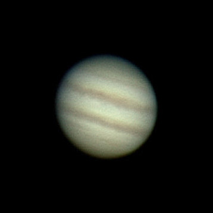

# Lightweight Markdown to Webpage Converter

## Overview

This project is a lightweight and simple tool that converts markdown files into a minimalist webpage. It's designed to be easy to use: just place your markdown files in a single folder, and they'll be automatically converted into a clean, readable webpage.

Just copy this folder into a directory with all your markdownfiles, create a `index.md` to make a Homepage and voilà: The Markdownfiles are now a Website. 

For further customization take a look at the html

## Features

### File Structure

The project has a simple file structure:

```
.
├── index.md
├── .media
│   └── jupiter.jpg
├── post1.md
├── post2.md
└── .source
    ├── index.html
    ├── markdownParser.js
    ├── post.html
    ├── second.css
    └── standard.css
```

- `index.md` will be the Homepage, the other markdownfiles (such as post1.md, post2.md) can be linked in the index.md.
- `.media`: This directory contains media files like images that can be used in the markdown files.
- `.source`: This directory is where the magic happens. 

### Markdown Features

The markdown parser supports the following features:

- **Headers**: Use `#` for headers. For example:

    ```markdown
    # Header 1
    ## Header 2
    ### Header 3
    ```

- **Bold Text**: Use `**` or `__` to make text bold. For example:

    ```markdown
    **Bold Text**
    __Bold Text__
    ```

- **Italic Text**: Use `*` or `_` to make text italic. For example:

    ```markdown
    *Italic Text*
    _Italic Text_
    ```

- **Links**: Use `[]()` to create a link. For example:

    ```markdown
    [Link Text](https://example.com)
    ```

- **Images**: Use `` to insert an image. For example:

    ```markdown
    
    ```

- **Blockquotes**: Use `>` to create a blockquote. For example:

    ```markdown
    > This is a blockquote.
    ```

- **Task Lists**: Use `- [ ]` for incomplete tasks and `- [x]` for completed tasks. For example:

    ```markdown
    - [x] Completed task
    - [ ] Incomplete task
    ```


## Motivation

This project was motivated by the work of the GitHub user casual-markdown. The goal was to create a simple and lightweight tool that can convert markdown files into a webpage, without the need for a complex setup or configuration.

The CSS for this project was heavily influenced by certain Typora themes and GitHub's design due to their minimalistic nature.
